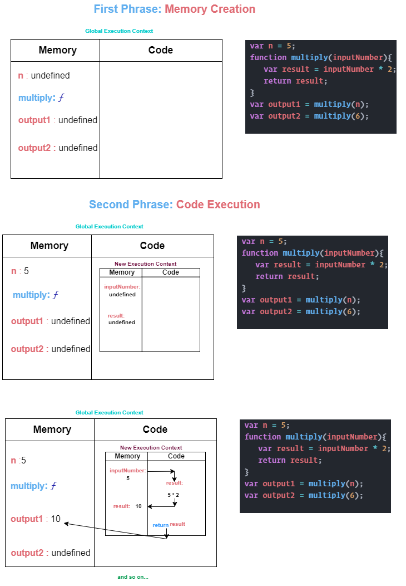
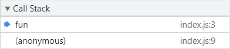

# JavaScript


## Resources

The following resources were used to compile this document:

- [MDN Web Docs](https://developer.mozilla.org/en-US/docs/Web/JavaScript)
- [W3Schools](https://www.w3schools.com/js/)

## What is JavaScript?
JavaScript is a `synchronous single-threaded` language.

`Synchronous` means `In Order(execute top to bottom)`

`Single-threaded` means `one thing at a time(line by line)`

## Why JavaScript is loosely typed or weakly typed?
JavaScript is a loosely typed language, meaning you don’t have to specify what type of information will be stored in a variable in advance. JavaScript automatically types a variable based on what kind of information you assign to it (e.g., that '' or " " to indicate string values). Many other languages, like Java, require you to declare a variable’s type, such as int, float, boolean, or String.

## How JavaScript works?
As soon as the whole program is run the global execution context is created.
The execution context is created into two parts:
- [Memory Creation Phase](###memory-creation-phase)
- [Code Execution Phase](###Memory-Creation-Phase)

### Memory Creation Phase:
In the first Phase the JavaScript engine comes through the whole program
line by line(single-threaded) & it allocates memory to all the variables & functions.
In the case of variable allocates a special value(placeholder) `undefined`.

### Code Execution Phase:
In the second Phase JavaScript engine once again run through the whole program line by line and it execute the code now.
When it invoke a new function a brand new execution context is created and this execution context again has the same two components. When JavaScript engine finish the execution of this function the execution context will be deleted. 
1) Memory Creation 
2) Code Execution



## What is Call Stack?
Call Stack maintains the order of execution of execution context.



Here `anonymous` represents the Global Execution & `fun` is a brand new function. Call stack maintains all the order of execution here.

## Hoisting in JavaScript.
Hoisting is the default behaviour of moving all the declarations at the top of the scope, before code execution.
Basically it gives us an advantage that no matter where variables & funtions are decalred.

For Example:
```js
fun(); // function declaration
console.log(x); 
var x = 20;
function fun(){
    console.log("Sumit Kr Das");
};
```
Output:
```
Sumit Kr Das
undefined
```

## Undefined vs Notdefined

`Undefined` means which which was allocates memory but not being assigned any value. In the other words A variable that has not been assigned a value is of type undefined.

For Example:

```js
function fun(val){
    if(val === undefined){
        return 'This value is Undefined!'
    }
    return 'Not Undefined';
}

var n;
console.log(fun(n));
```
Output:
```
This value is Undefined!
```

`Notdefined` means which was not being allocates memory. In the other words it is one of the reference errors that JavaScript will throw when someone accesses the variable which is not inside the memory heap.

For Example:
```js
function fun(val){
    if(val === undefined){
        return 'This value is Undefined!'
    }
    return 'Not Undefined';
}

// var n;
console.log(fun(n));
```
Output:
```
ReferenceError: n is not defined
```
